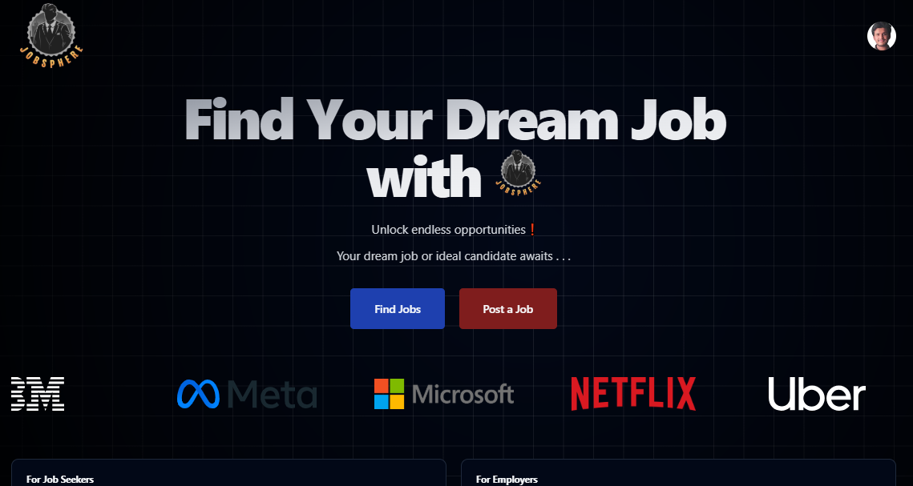

# JobSphere

**JobSphere** is a dynamic Job Portal web application built with React, designed to streamline job search and recruitment. It allows job seekers to find and apply for jobs, while recruiters and employers can post job listings. The application offers a user-friendly interface for both job seekers and recruiters.

## Features

- **User Authentication**: Secure login and registration for job seekers and employers.
- **Job Search**: Filter job listings by keywords, location, and category.
- **Job Applications**: Apply directly to listings and track application status.
- **Recruiter Access**: Recruiters can manage job postings and review applicants.
- **Employer Access**: Employers can find and apply for job opportunities.
- **Responsive Design**: Optimized for both desktop and mobile devices.

## Technologies Used

- **Frontend**: React, JSX, Tailwind CSS, JavaScript
- **Database**: Supabase
- **Authentication**: Clerk
- **UI Tools**: ShadCN UI for frontend components

## WEB 

## License
- This project is licensed under the MIT License - see the [LICENSE](LICENSE) file for details.
